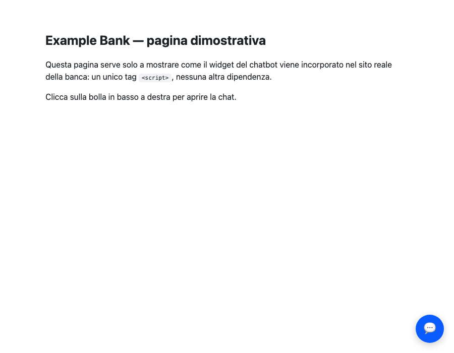
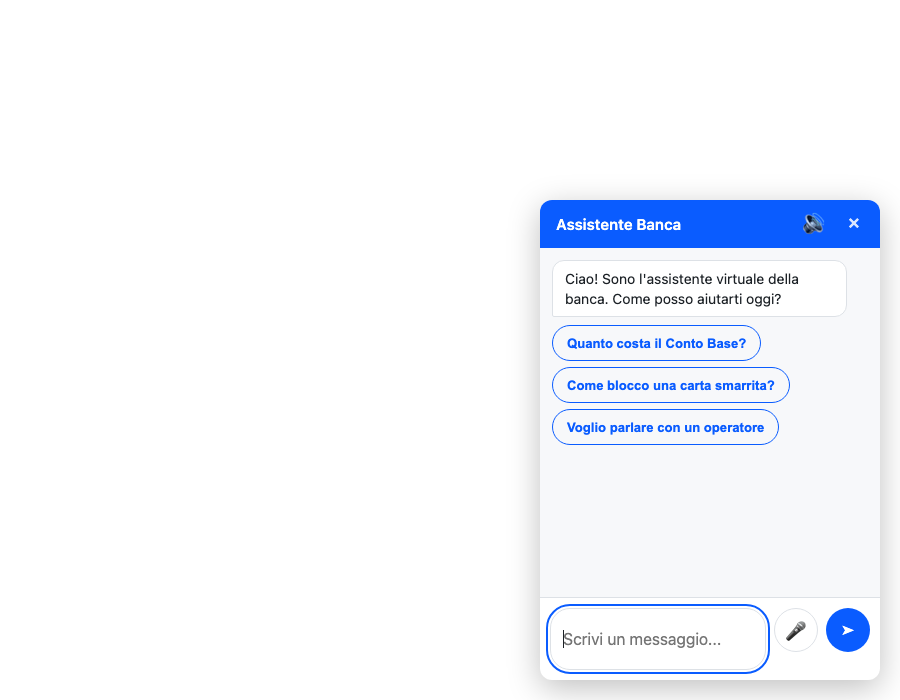
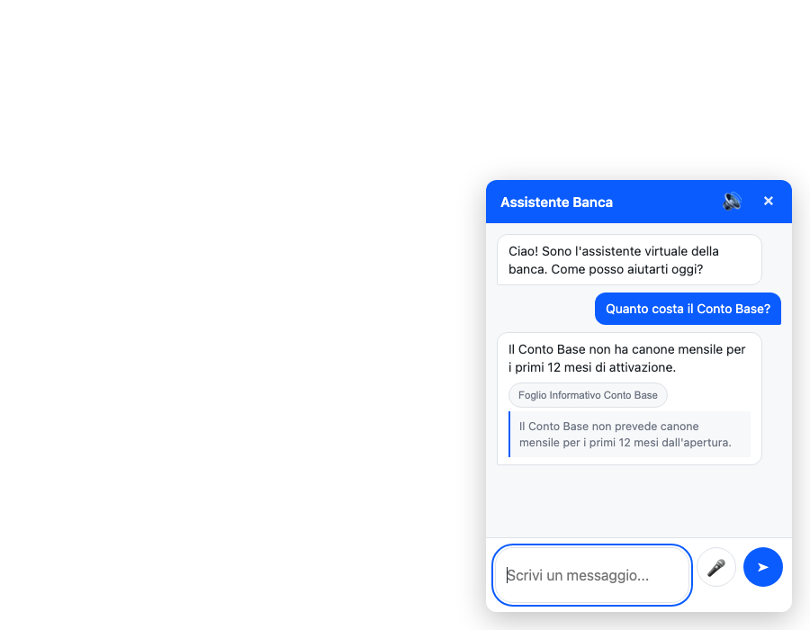
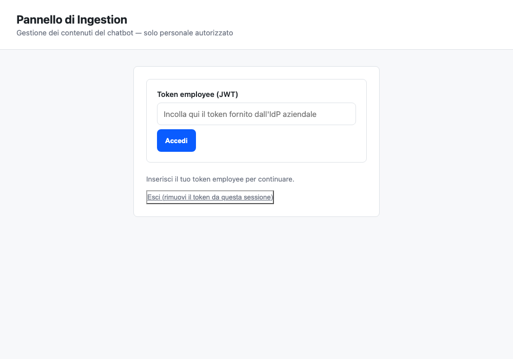
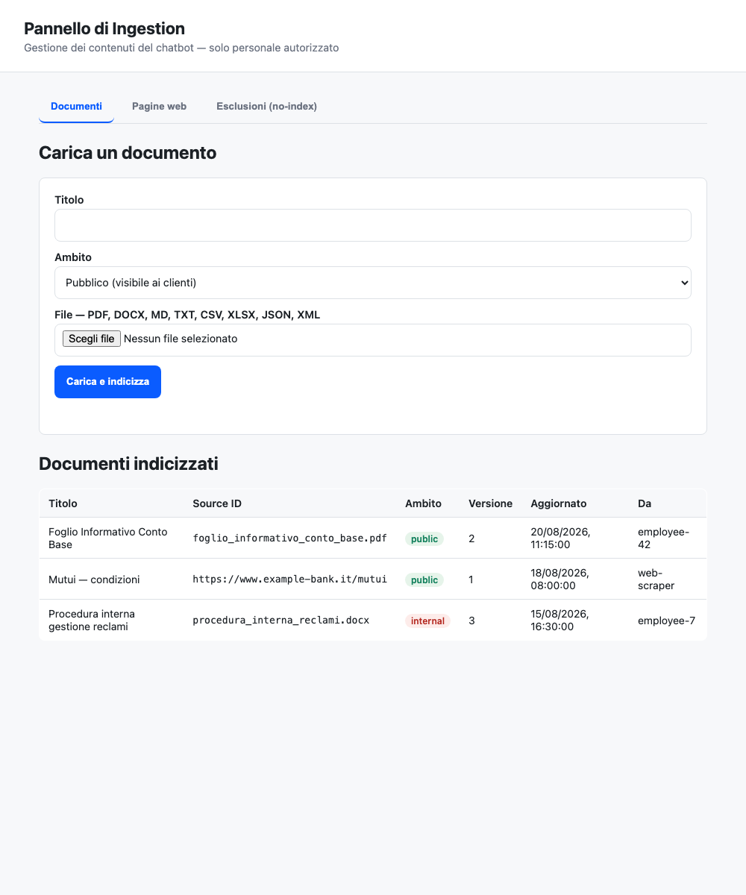
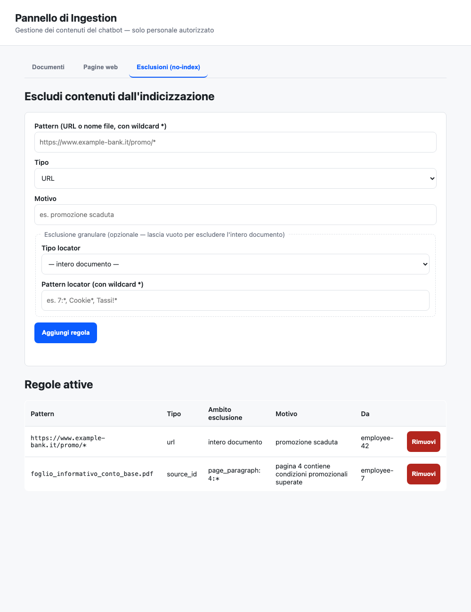

# Bank RAG Bot

[English](#english) | [Italiano](#italiano)

---

## English

Agentic RAG chatbot for a bank's website: answers using both the site's
public content and internal documents uploaded by bank employees, with
grounding guardrails and RBAC on indexed data.

See [ARCHITECTURE.md](ARCHITECTURE.md) for the full rationale behind every
architectural choice, and for what's still missing before production.

### Screenshots

Captured with headless Chrome against this repository's real static UI
files — not graphic mockups. The widget conversation uses declared example
response data (the backend needs Qdrant/OpenSearch/Postgres/Redis/OpenAI
running, none of which were active for this capture); the admin UI uses
example data for its tables (Postgres wasn't running either). The markup,
CSS, and JS logic are the real, unmodified code — only the data behind them
is a declared stand-in.

#### Customer widget

| Closed | Open (suggested questions) | Conversation (expanded citation) |
|---|---|---|
|  |  |  |

Real streaming responses (SSE), clickable citations with snippets,
suggested questions, microphone/read-aloud via the browser's native Web
Speech API (visible only when the browser supports it).

#### Admin panel — ingestion

| Login (JWT token) | Document management | Granular exclusions (no-index) |
|---|---|---|
|  |  |  |

Upload for 8 formats (PDF/DOCX/MD/TXT/CSV/XLSX/JSON/XML), on-demand URL
indexing, and exclusion from indexing either for a whole document or for a
specific portion (page, section, row range — see the `page_paragraph: 4:*`
rule in the screenshot, which excludes only one paragraph of one PDF page
without touching the rest of the document).

### Quickstart

**Guided setup** (recommended — checks Docker, creates `.env` by asking for
keys, brings up the containers, waits until they're ready, provisions
Qdrant):

```bash
make setup
```

**Manual setup**, step by step:

```bash
cp .env.example .env   # fill in OPENAI_API_KEY, CORE_BANKING_*
docker compose up -d qdrant opensearch redis postgres   # = make up
python -m bank_rag.infrastructure.vector_stores.qdrant_bootstrap   # = make bootstrap
pip install -e ".[dev]"
uvicorn bank_rag.interface.api.main:app --reload   # = make run
```

Qdrant, OpenSearch, Redis, and Postgres are fully containerized — no manual
installation on the host, just Docker. OpenAI is the one exception, since
it's a paid external API, not self-hostable software — for a fully
local/free setup, replace `OpenAiChatClient`/`OpenAiEmbedder` with an Ollama
adapter behind the same `LLMClient`/`Embedder` ports.

### Tests

```bash
pytest
```

### Main endpoints

- `POST /chat` — customer message (authenticated or anonymous) -> grounded answer + citations.
- `POST /admin/documents` — file upload (PDF/DOCX/MD/TXT/CSV/XLSX/JSON/XML) by an employee (requires an employee token).
- `GET /admin/documents` — list of indexed documents.
- `POST /admin/urls` — indexes a single site page on demand (in addition to the periodic sync in `ingestion/pipeline.py`).
- `GET/POST/DELETE /admin/noindex` — indexing-exclusion rules, for a whole document or a specific portion (page/section/row — see ARCHITECTURE.md).
- `GET /health`

### Web interfaces

Two static UIs (plain HTML/CSS/JS, no framework, no build step), served by
the same FastAPI app as a presentation layer on top of the JSON API — zero
duplicated business logic:

- **`/admin-ui/`** — employee panel: file upload, on-demand URL indexing, no-index rule management (including granular page/section rules). Requires an employee JWT, entered manually and kept only in `sessionStorage` (never persisted).
- **`/widget/`** — customer chat widget, embeddable in the bank's site with a single `<script type="module">` tag. `/widget/index.html` is a demo page showing the real integration.

### How it works, and why

This is *agentic* RAG, not "embed the question, stuff the top chunks into a
prompt, done" — the difference shows up in three places: how data gets in,
how the agent decides what to do with a question, and what stops it from
making things up. Each of the three exists as real code, referenced below.

#### 1. Ingestion — two sources, one pipeline

Public and internal content come from genuinely different trust levels, so
they enter through different doors but land in the same shape:

- **Public site content**: [`WebScraper`](src/bank_rag/ingestion/loaders/web_scraper.py)
  is a scheduled job (`ingestion-worker` in `docker-compose.yml`, driven by
  [`ingestion/pipeline.py`](src/bank_rag/ingestion/pipeline.py)) that pulls
  pages from an allow-listed domain and indexes them tagged
  `audience: PUBLIC`. Honest limitation stated in the code itself: the URL
  list is a placeholder — production should discover pages from the site's
  `sitemap.xml`, not a hardcoded list.
- **Employee documents**: the admin panel (`POST /admin/documents`) accepts
  8 formats (PDF/DOCX/MD/TXT/CSV/XLSX/JSON/XML), each with its own
  segmenter in [`ingestion/segmentation/`](src/bank_rag/ingestion/segmentation/),
  tagged `audience: INTERNAL` by default — an employee has to explicitly
  choose `PUBLIC` to make a document customer-visible, not the other way
  around.
- **Chunking**: [`SemanticChunker`](src/bank_rag/ingestion/chunking/semantic_chunker.py)
  splits on sentence boundaries with overlap, instead of a fixed character
  count — a naive cut is exactly what you don't want when the cut lands
  inside a rate or an account number.
- **Embedding + storage**: chunks go through `OpenAiEmbedder` and into
  Qdrant, each vector's payload carrying the `audience` tag and the
  `ChunkLocator` (document/page/paragraph) that makes the granular no-index
  exclusion in the admin panel possible down to a single paragraph.
- **Caching frequent questions**: [`RedisResponseCache`](src/bank_rag/infrastructure/cache/redis_cache.py)
  caches the final answer keyed on the *rewritten* question (post
  query-rewriting, so "and the transfer?" and "how much does a transfer on
  Conto Base cost?" can hit the same entry) — but **only for anonymous,
  unauthenticated visitors, and only when the answer was actually grounded
  with no pending confirmation**. An authenticated customer's answer can
  contain account-specific data, so it's never cached; see
  `AnswerQuestion.execute_streaming` for the exact gate.
- **Rate/offer expiry**: `DocumentMetadata.valid_until` — an expired rate
  sheet is excluded server-side from both indexes (Qdrant *and* OpenSearch,
  since hybrid retrieval fuses both), not filtered after the fact. A bank
  chatbot quoting a lapsed promotional rate is a compliance incident, not a
  stale-cache inconvenience.
- **Tables, not flattened prose**: `pdf_segmenter.py` detects real tables
  (`pdfplumber.find_tables()`, ruled borders, not a heuristic) and emits
  each as its own Markdown-table chunk — a rate table read left-to-right as
  prose loses the alignment between a duration and its rate, exactly the
  failure mode that matters most here.

#### 2. Agentic orchestration — a router agent, not a fixed pipeline

[`RouterAgent`](src/bank_rag/agents/orchestrator.py) runs a bounded
ReAct-style loop, not a single retrieve-then-generate call: the LLM sees the
conversation plus the available tool schemas, and on each turn either
answers directly or emits tool calls; tool results are appended as messages
and the LLM is invoked again, until it stops calling tools or
`max_iterations` is hit.

- **Intent analysis**: the system prompt tells the model what each tool is
  for (`search_knowledge_base` for product/fee/branch questions,
  `get_account_balance` for the customer's own balance,
  `lock_card` for a lost/stolen card, `find_branches` for locations) — the
  model decides which to call, if any, rather than a hardcoded intent
  classifier upstream of retrieval.
- **Tool use, including multi-step**: this one loop covers both the trivial
  case (a greeting, zero tool calls) and "compare product X vs Y", which
  the model handles by issuing multiple sequential
  `search_knowledge_base` calls and synthesizing the results itself — no
  special-cased "comparison mode".
- **Multi-turn memory**: [`RedisConversationRepository`](src/bank_rag/infrastructure/persistence/redis_conversation_repository.py)
  persists the full turn history (and any `pending_action`) between HTTP
  requests, so "and how much does the transfer cost?" resolves against
  the "Conto Base" mentioned two messages earlier — a real bug was found
  and fixed here: the serializer originally dropped `pending_action`
  entirely, invisible in unit tests (where the same in-memory `Conversation`
  object survives between calls) but real over an actual HTTP round trip,
  where every request deserializes a fresh `Conversation` from Redis. See
  [`test_redis_conversation_repository.py`](tests/unit/test_redis_conversation_repository.py)
  for the regression test written specifically for that class of bug.

**Retrieval itself**: vector search (Qdrant) + lexical BM25 (OpenSearch),
fused with Reciprocal Rank Fusion, then narrowed by a cross-encoder
reranker to the final `top_k` — not vector similarity alone, because that
alone loses exact terms (product codes, percentages) typical of banking
documents. Full rationale in [ARCHITECTURE.md](ARCHITECTURE.md).

#### 3. Guardrails, not just prompt instructions

A prompt that says "only answer from context" is a suggestion the model can
ignore under pressure; everything below is a structural check the code
enforces regardless of what the model decides to say:

- **RBAC on vectors, server-side**: [`RagSearchTool`](src/bank_rag/agents/tools/rag_search_tool.py)
  is constructed with `allowed_audiences` computed once in
  [`di_container.py`](src/bank_rag/di_container.py) from the caller's auth
  state (`[PUBLIC]` for anonymous, `[PUBLIC, INTERNAL]` for an
  authenticated customer) — the filter is a Qdrant query parameter, not a
  prompt instruction the model could be talked out of.
- **Strict grounding**: [`TopicGuardrail`](src/bank_rag/agents/topic_guardrail.py)
  rejects non-banking questions *before* spending an agent loop on them
  (fail-*open* — a false positive here wrongly blocks a legitimate banking
  question, the worse cost); if the model still answers without any tool
  result backing it up, the answer is discarded and replaced with a fixed
  fallback ("I don't have this information, connecting you to an agent") —
  see `grounded` in `orchestrator.py`.
- **Sentiment escalation**: [`SentimentEscalationGuardrail`](src/bank_rag/agents/sentiment_escalation_guardrail.py)
  uses the *opposite* fail-mode on purpose — fail-*closed* (ambiguous ->
  escalate immediately), because missing a genuinely frustrated customer
  costs more than an occasional unnecessary handoff.
- **Explicit confirmation before high-risk actions**: locking a card is not
  executed the moment the model calls the tool — `RouterAgent` stores a
  `PendingAction` on the conversation and asks the customer to confirm;
  only a dedicated [`ConfirmationGuardrail`](src/bank_rag/agents/confirmation_guardrail.py)
  (fail-closed, same reasoning as sentiment) unlocks the actual `.run()`.
- **Maker-Checker on numbers**: [`NumericGroundingGuardrail`](src/bank_rag/agents/numeric_grounding_guardrail.py)
  — `grounded` only proves a tool backed *some* part of the answer, not
  that the specific rate/fee the model wrote down matches the source (a
  model can misread "3.5%" as "3.05%" while genuinely believing it's
  quoting faithfully). A second, narrow-scope LLM pass compares every
  number in the answer against the citations before it's treated as
  trustworthy for caching or audit; fail-closed, same reasoning as
  sentiment escalation.
- **PII filter, prompt-injection sanitizer, append-only audit trail**: every
  customer message is scrubbed of account numbers/IDs before it reaches the
  LLM ([`pii_filter_regex.py`](src/bank_rag/infrastructure/security/pii_filter_regex.py)),
  every uploaded document is sanitized against embedded instructions
  aimed at the model, and every exchange is written to an append-only log
  regardless of outcome.

**What's actually been verified, not just written**: 78 unit tests
(in-memory fakes, zero network), plus a smoke test with `uvicorn` actually
running and real HTTP requests (routing, JWT, rate limiting) — see the
"End-to-end smoke test" section in ARCHITECTURE.md for the exact outcome
and the two real bugs found that way (not by the tests).

**What has never been verified against real services**: an actual answer
with Qdrant/OpenSearch/Postgres/Redis/OpenAI all running together — not
done in this session due to disk space constraints on the development
machine, stated explicitly, not hidden.

**What's still out of scope, listed plainly**: money transfers/payments via
chat (excluded on purpose, not forgotten — see the RouterAgent's system
prompt), transaction history and budgeting (would need a real core-banking
system behind `BankApiClient`, which here is an HTTP client to a system
that doesn't exist), multi-channel WhatsApp/SMS (needs real business
accounts I don't have). Full list with reasoning in ARCHITECTURE.md.

### Structure

```
src/bank_rag/
  domain/            pure entities, no external dependency
  application/
    ports/            interfaces (Protocol) toward every external system
    use_cases/         AnswerQuestion, IngestDocument, ManageNoIndexRules
  agents/              RouterAgent + ToolRegistry + Tools (the "agentic" layer)
  infrastructure/      concrete adapters: Qdrant, OpenSearch, OpenAI, Redis, SQL, core banking
  ingestion/           pipeline + per-format segmenters (segmentation/)
  interface/
    api/               FastAPI: thin routers, no business logic
    web/               the two static UIs (admin/, widget/)
  observability/       OpenTelemetry tracing + offline RAGAS eval
  config/              Settings (pydantic-settings, from env/.env)
  di_container.py       the single place wiring ports -> adapters
```

---

## Italiano

Chatbot agentico per il sito di una banca: risponde usando sia i contenuti
pubblici del sito sia documenti interni caricati dai dipendenti, con
guardrail di grounding e RBAC sui dati indicizzati.

Vedi [ARCHITECTURE.md](ARCHITECTURE.md) per il razionale delle scelte
architetturali e cosa manca ancora per la produzione.

### Screenshot

Catturati con Chrome headless contro le UI statiche reali di questo repository — non mockup grafici. Il widget usa dati di risposta di esempio (dichiarati come tali: il backend richiede Qdrant/OpenSearch/Postgres/Redis/OpenAI in esecuzione, non attivi in questa cattura), la UI admin usa dati di esempio per la tabella (backend Postgres non in esecuzione). Il markup, il CSS e la logica JS sono quelli reali, non modificati per lo screenshot.

#### Widget cliente

| Chiuso | Aperto (domande suggerite) | Conversazione (citazione espansa) |
|---|---|---|
|  |  |  |

Streaming reale della risposta (SSE), citazioni cliccabili con snippet, domande suggerite, microfono/lettura vocale via Web Speech API nativa del browser (visibili solo se il browser le supporta).

#### Pannello admin — ingestion

| Accesso (token JWT) | Gestione documenti | Esclusioni granulari (no-index) |
|---|---|---|
|  |  |  |

Upload di 8 formati (PDF/DOCX/MD/TXT/CSV/XLSX/JSON/XML), indicizzazione URL on-demand, ed esclusione dall'indicizzazione sia per intero documento sia per porzione specifica (pagina, sezione, riga — vedi la riga `page_paragraph: 4:*` nello screenshot, che esclude solo un paragrafo di una pagina di un PDF senza toccare il resto).

### Quickstart

**Setup guidato** (consigliato — controlla Docker, crea `.env` chiedendo le chiavi, alza i container, aspetta che siano pronti, provisiona Qdrant):

```bash
make setup
```

**Setup manuale**, passo per passo:

```bash
cp .env.example .env   # valorizza OPENAI_API_KEY, CORE_BANKING_*
docker compose up -d qdrant opensearch redis postgres   # = make up
python -m bank_rag.infrastructure.vector_stores.qdrant_bootstrap   # = make bootstrap
pip install -e ".[dev]"
uvicorn bank_rag.interface.api.main:app --reload   # = make run
```

Qdrant, OpenSearch, Redis e Postgres sono interamente containerizzati: nessuna
installazione manuale sul sistema, solo Docker. OpenAI resta l'unica eccezione
perché è un'API esterna a pagamento, non software auto-ospitabile — per un
setup completamente locale/gratuito, sostituire `OpenAiChatClient`/`OpenAiEmbedder`
con un adapter Ollama dietro le stesse porte `LLMClient`/`Embedder`.

### Test

```bash
pytest
```

### Endpoint principali

- `POST /chat` — messaggio utente (autenticato o anonimo) -> risposta grounded + citazioni.
- `POST /admin/documents` — upload file (PDF/DOCX/MD/TXT/CSV/XLSX/JSON/XML) da parte di un dipendente (richiede token employee).
- `GET /admin/documents` — elenco documenti indicizzati.
- `POST /admin/urls` — indicizza una singola pagina del sito su richiesta (oltre alla sincronizzazione periodica in `ingestion/pipeline.py`).
- `GET/POST/DELETE /admin/noindex` — regole di esclusione dall'indicizzazione, per intero documento o per porzione (pagina/sezione/riga — vedi ARCHITECTURE.md).
- `GET /health`

### Interfacce web

Due UI statiche (HTML/CSS/JS puro, nessun framework, nessuna build), servite dalla stessa app FastAPI come layer di presentazione sopra l'API JSON — zero logica di business duplicata:

- **`/admin-ui/`** — pannello per i dipendenti: upload file, indicizzazione URL on-demand, gestione regole no-index (incluse quelle granulari per pagina/sezione). Richiede un token JWT employee, inserito manualmente e tenuto solo in `sessionStorage` (mai persistito).
- **`/widget/`** — widget chat per i clienti, incorporabile nel sito della banca con un solo `<script type="module">`. `/widget/index.html` è una pagina dimostrativa che mostra l'integrazione reale.

### Come funziona, e perché

Questo è un RAG *agentico*, non "trasforma la domanda in vettore, infila i
chunk migliori nel prompt, fine" — la differenza si vede in tre punti: come
entrano i dati, come l'agente decide cosa fare con una domanda, e cosa gli
impedisce di inventarsi le risposte. Tutti e tre esistono come codice reale, citato qui sotto.

#### 1. Ingestion — due fonti, una sola pipeline

Contenuti pubblici e interni hanno livelli di fiducia realmente diversi,
quindi entrano da porte diverse ma finiscono nella stessa forma:

- **Contenuti pubblici del sito**: [`WebScraper`](src/bank_rag/ingestion/loaders/web_scraper.py)
  è un job schedulato (`ingestion-worker` in `docker-compose.yml`, guidato
  da [`ingestion/pipeline.py`](src/bank_rag/ingestion/pipeline.py)) che
  legge pagine da un dominio in allow-list e le indicizza con
  `audience: PUBLIC`. Limite dichiarato onestamente nel codice stesso:
  l'elenco URL è un placeholder — in produzione andrebbero scoperte le
  pagine dalla `sitemap.xml` del sito, non da una lista fissa.
- **Documenti dei dipendenti**: il pannello admin (`POST /admin/documents`)
  accetta 8 formati (PDF/DOCX/MD/TXT/CSV/XLSX/JSON/XML), ciascuno col
  proprio segmentatore in [`ingestion/segmentation/`](src/bank_rag/ingestion/segmentation/),
  taggati `audience: INTERNAL` di default — un dipendente deve scegliere
  esplicitamente `PUBLIC` per rendere un documento visibile ai clienti, non
  il contrario.
- **Chunking**: [`SemanticChunker`](src/bank_rag/ingestion/chunking/semantic_chunker.py)
  divide sui confini di frase con overlap, non a numero fisso di caratteri
  — un taglio ingenuo è esattamente ciò che non vuoi quando cade dentro un
  tasso o un numero di conto.
- **Embedding e storage**: i chunk passano per `OpenAiEmbedder` e finiscono
  su Qdrant, con ogni vettore che porta nel payload il tag `audience` e il
  `ChunkLocator` (documento/pagina/paragrafo) che rende possibile
  l'esclusione granulare dall'indicizzazione nel pannello admin, fino a un
  singolo paragrafo.
- **Cache delle domande frequenti**: [`RedisResponseCache`](src/bank_rag/infrastructure/cache/redis_cache.py)
  mette in cache la risposta finale usando come chiave la domanda *riscritta*
  (dopo il query-rewriting, così "e il bonifico?" e "quanto costa un
  bonifico sul Conto Base?" possono colpire la stessa voce) — ma **solo per
  visitatori anonimi non autenticati, e solo se la risposta era
  effettivamente grounded e senza conferma in sospeso**. La risposta a un
  cliente autenticato può contenere dati specifici del conto, quindi non
  viene mai messa in cache — vedi il gate esatto in
  `AnswerQuestion.execute_streaming`.
- **Scadenza tassi/offerte**: `DocumentMetadata.valid_until` — un foglio
  tassi scaduto viene escluso server-side da entrambi gli indici (Qdrant
  *e* OpenSearch, perché il retrieval ibrido fonde entrambi), non filtrato
  a posteriori. Un chatbot bancario che cita un tasso promozionale scaduto
  è un incidente di conformità, non un fastidio da cache non aggiornata.
- **Tabelle, non prosa appiattita**: `pdf_segmenter.py` rileva le tabelle
  reali (`pdfplumber.find_tables()`, bordi disegnati, non un'euristica) e
  ognuna diventa un chunk Markdown a sé — una tabella tassi letta come
  prosa perde l'allineamento tra durata e tasso, esattamente il tipo di
  errore più grave qui.

#### 2. Orchestrazione agentica — un router agent, non una pipeline fissa

[`RouterAgent`](src/bank_rag/agents/orchestrator.py) esegue un ciclo
limitato in stile ReAct, non una singola chiamata retrieve-poi-genera: il
modello vede la conversazione più gli schemi dei tool disponibili, e a ogni
turno o risponde direttamente o emette chiamate a tool; i risultati dei
tool vengono aggiunti come messaggi e il modello viene invocato di nuovo,
finché non smette di chiamare tool o si raggiunge `max_iterations`.

- **Analisi dell'intento**: il system prompt spiega al modello a cosa serve
  ogni tool (`search_knowledge_base` per domande su prodotti/costi/filiali,
  `get_account_balance` per il saldo del cliente stesso, `lock_card` per
  una carta persa/rubata, `find_branches` per le sedi) — è il modello a
  decidere quale chiamare, se serve, invece di un classificatore di intenti
  fisso a monte del retrieval.
- **Uso dei tool, anche multi-passo**: lo stesso ciclo copre sia il caso
  banale (un saluto, zero chiamate tool) sia "confronta il prodotto X con
  Y", che il modello gestisce emettendo più chiamate sequenziali a
  `search_knowledge_base` e sintetizzando da sé i risultati — nessuna
  "modalità confronto" gestita a parte.
- **Memoria multi-turno**: [`RedisConversationRepository`](src/bank_rag/infrastructure/persistence/redis_conversation_repository.py)
  persiste l'intera cronologia dei turni (e l'eventuale `pending_action`)
  tra una richiesta HTTP e l'altra, così "e quanto costa il bonifico?" si
  risolve rispetto al "Conto Base" citato due messaggi prima — qui è stato
  trovato e corretto un bug reale: il serializzatore in origine perdeva del
  tutto `pending_action`, invisibile negli unit test (dove la stessa
  istanza `Conversation` in memoria sopravvive tra le chiamate) ma reale su
  un vero giro HTTP, dove ogni richiesta deserializza una `Conversation`
  nuova da Redis. Vedi [`test_redis_conversation_repository.py`](tests/unit/test_redis_conversation_repository.py)
  per il test di regressione scritto apposta per questa classe di bug.

**Il retrieval in sé**: vector search (Qdrant) + BM25 lessicale
(OpenSearch), fusi con Reciprocal Rank Fusion, poi ridotti con un reranker
cross-encoder ai `top_k` finali — non solo similarità vettoriale, perché
quest'ultima da sola perde termini esatti (codici prodotto, percentuali)
tipici di documenti bancari. Dettagli e motivazioni in [ARCHITECTURE.md](ARCHITECTURE.md).

#### 3. Guardrail, non solo istruzioni nel prompt

Un prompt che dice "rispondi solo dal contesto" è un suggerimento che il
modello può ignorare sotto pressione; tutto quello che segue è invece un
controllo strutturale imposto dal codice, indipendentemente da cosa decide
di dire il modello:

- **RBAC sui vettori, lato server**: [`RagSearchTool`](src/bank_rag/agents/tools/rag_search_tool.py)
  viene costruito con `allowed_audiences` calcolato una volta in
  [`di_container.py`](src/bank_rag/di_container.py) a partire dallo stato
  di autenticazione del chiamante (`[PUBLIC]` per anonimo, `[PUBLIC,
  INTERNAL]` per cliente autenticato) — il filtro è un parametro della
  query Qdrant, non un'istruzione nel prompt che il modello potrebbe essere
  convinto a ignorare.
- **Grounding rigoroso**: [`TopicGuardrail`](src/bank_rag/agents/topic_guardrail.py)
  rifiuta le domande non bancarie *prima* di spendere un ciclo
  dell'agente (fail-*open* — un falso positivo qui blocca erroneamente una
  domanda bancaria legittima, il costo peggiore); se il modello risponde
  comunque senza alcun risultato di tool a supporto, la risposta viene
  scartata e sostituita da un fallback fisso ("Non ho questa informazione,
  ti metto in contatto con un operatore") — vedi `grounded` in
  `orchestrator.py`.
- **Escalation su sentiment**: [`SentimentEscalationGuardrail`](src/bank_rag/agents/sentiment_escalation_guardrail.py)
  usa deliberatamente il fail-mode *opposto* — fail-*chiuso* (in dubbio,
  esclude subito), perché perdere un cliente davvero in difficoltà costa
  più di un handoff occasionale non necessario.
- **Conferma esplicita prima di azioni ad alto rischio**: il blocco carta
  non viene eseguito nel momento in cui il modello chiama il tool —
  `RouterAgent` salva un `PendingAction` sulla conversazione e chiede
  conferma al cliente; solo un [`ConfirmationGuardrail`](src/bank_rag/agents/confirmation_guardrail.py)
  dedicato (fail-chiuso, stessa logica del sentiment) sblocca la vera
  esecuzione di `.run()`.
- **Maker-Checker sui numeri**: [`NumericGroundingGuardrail`](src/bank_rag/agents/numeric_grounding_guardrail.py)
  — `grounded` prova solo che un tool ha fornito una base alla risposta,
  non che il tasso/costo specifico scritto dal modello coincida con la
  fonte (un modello può leggere male "3,5%" come "3,05%" credendo comunque
  di citare fedelmente). Un secondo passaggio LLM a scopo ristretto
  confronta ogni numero nella risposta con le citazioni prima che sia
  trattata come affidabile per cache o audit; fail-chiuso, stessa logica
  dell'escalation su sentiment.
- **Filtro PII, sanitizer anti prompt-injection, audit trail append-only**:
  ogni messaggio del cliente viene ripulito da numeri di conto/ID prima di
  raggiungere l'LLM ([`pii_filter_regex.py`](src/bank_rag/infrastructure/security/pii_filter_regex.py)),
  ogni documento caricato viene sanitizzato contro istruzioni nascoste
  rivolte al modello, e ogni scambio viene scritto in un log append-only
  indipendentemente dall'esito.

**Cosa è verificato per davvero, non solo scritto**: 78 unit test (fake in memoria, zero rete), più uno smoke test con `uvicorn` avviato realmente e richieste HTTP vere (routing, JWT, rate limiting) — vedi la sezione "Smoke test end-to-end" in ARCHITECTURE.md per l'esito esatto e i due bug reali trovati così (non nei test).

**Cosa NON è mai stato verificato contro servizi reali**: una vera risposta con Qdrant/OpenSearch/Postgres/Redis/OpenAI tutti in esecuzione insieme — non fatto in questa sessione per limiti di spazio disco della macchina di sviluppo, dichiarato esplicitamente, non nascosto.

**Cosa resta fuori scope, elencato senza giri di parole**: bonifici/pagamenti via chat (esclusi di proposito, non per dimenticanza — vedi il system prompt del RouterAgent), storico transazioni e budgeting (richiederebbero un vero core banking dietro `BankApiClient`, che qui è un client HTTP verso un sistema che non esiste), multi-canale WhatsApp/SMS (richiede account business reali che non ho). Elenco completo con motivazioni in ARCHITECTURE.md.

### Struttura

```
src/bank_rag/
  domain/            entità pure, nessuna dipendenza esterna
  application/
    ports/            interfacce (Protocol) verso ogni sistema esterno
    use_cases/         AnswerQuestion, IngestDocument, ManageNoIndexRules
  agents/              RouterAgent + ToolRegistry + Tools (il layer "agentic")
  infrastructure/      adapter concreti: Qdrant, OpenSearch, OpenAI, Redis, SQL, core-banking
  ingestion/           pipeline + segmentatori per formato (segmentation/)
  interface/
    api/               FastAPI: routers sottili, nessuna logica di business
    web/               le due UI statiche (admin/, widget/)
  observability/       tracing OpenTelemetry + eval offline RAGAS
  config/              Settings (pydantic-settings, da env/.env)
  di_container.py       unico punto che collega port -> adapter
```
